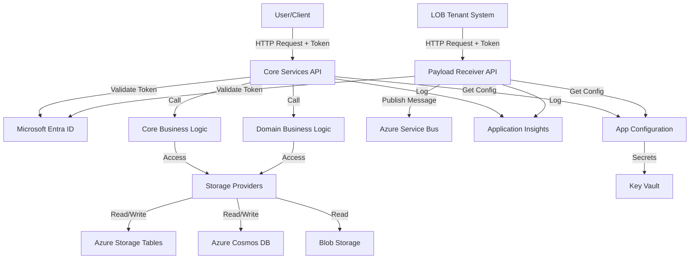
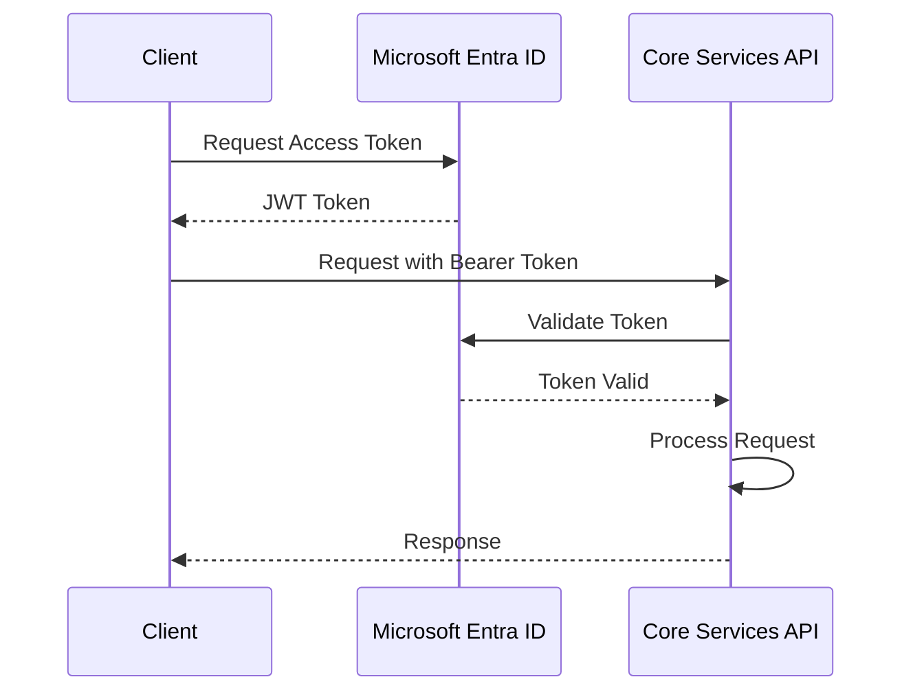

# APIs

## Summary

This folder contains the ASP.NET Core Web API projects that serve as the primary entry points for the Microsoft Assent Approvals Platform. These APIs provide RESTful endpoints for:

- **User interactions**: Web portal, mobile apps, and third-party integrations accessing approval data
- **System integrations**: Line-of-business (LOB) applications submitting approval requests
- **Administrative functions**: Support portal and troubleshooting tools

### Main Function/Purpose

The APIs in this folder implement the application layer of the Approvals Platform, exposing business capabilities through HTTP endpoints. They handle:

1. **Request authentication and authorization** using Microsoft Entra ID tokens
2. **Input validation and transformation** of incoming requests
3. **Business logic orchestration** by coordinating calls to Core and Domain business logic layers
4. **Data access** through provider interfaces to Azure Storage, Cosmos DB, and other data sources
5. **Response formatting** with proper HTTP status codes and JSON payloads

### When/Why Developers Work With This Code

Developers work with these APIs when:

- Adding new endpoints or features to the platform
- Modifying existing API behavior or response formats
- Debugging issues reported by users or tenant systems
- Implementing authentication/authorization changes
- Optimizing API performance or adding caching
- Updating OpenAPI/Swagger documentation
- Integrating new LOB systems or clients

### Key Technologies

- **.NET 8.0** - Runtime framework
- **ASP.NET Core** - Web API framework
- **Swashbuckle (Swashbuckle.AspNetCore)** - OpenAPI/Swagger documentation generation
- **Microsoft.Identity.Web** - Microsoft Entra ID authentication
- **Azure.Identity** - Managed identity for Azure service access
- **Application Insights SDK** - Telemetry and logging
- **Polly** - Resilience and retry policies for HTTP calls
- **Newtonsoft.Json** - JSON serialization

## Folder Structure

```
APIs/
├── Approvals.CoreServices/              # Core Services API - Primary user-facing API
│   ├── Controllers/                     # API endpoint controllers
│   │   ├── AboutController.cs           # Health and version info
│   │   ├── SummaryController.cs         # Approval summaries
│   │   ├── DetailsController.cs         # Detailed approval information
│   │   ├── DocumentActionController.cs  # Approval action processing
│   │   ├── HistoryController.cs         # Approval history
│   │   ├── UserDelegationController.cs  # Delegation management
│   │   └── ... (more controllers)
│   ├── Middleware/                      # Custom middleware components
│   │   └── AuthorizationMiddleware.cs   # Authorization logic
│   ├── Program.cs                       # Application entry point and DI configuration
│   ├── appsettings.json                 # Configuration (mostly overridden by App Configuration)
│   └── Approvals.CoreServices.csproj    # Project file
│
└── Approvals.PayloadReceiverService/    # Payload Receiver API - LOB integration endpoint
    ├── Controllers/                     # API endpoint controllers
    │   └── PayloadReceiverController.cs # Payload submission endpoint
    ├── Program.cs                       # Application entry point
    ├── appsettings.json                 # Configuration
    └── Approvals.PayloadReceiverService.csproj  # Project file
```

### File Naming Conventions

- **Controllers**: `{EntityName}Controller.cs` - Each controller handles operations for a specific entity or feature area
- **Middleware**: `{Purpose}Middleware.cs` - Custom middleware components for cross-cutting concerns
- **Program.cs**: Standard ASP.NET Core 6+ entry point pattern (no Startup.cs)

## Components

### Core Services API

**Purpose**: Main API for the web portal, Teams, and Outlook integrations

**Responsibilities**:
- Serve approval summaries and details to authenticated users
- Process approval actions (approve, reject, reassign, etc.)
- Manage user delegations and preferences
- Provide tenant configuration information
- Deliver AI-powered insights and recommendations
- Handle feedback submission
- Expose health check endpoints

**Key Controllers**:

| Controller | Endpoint Base | Purpose |
|------------|---------------|---------|
| AboutController | `/api/v1/about` | Service health and version information |
| SummaryController | `/api/v1/summary` | Retrieve approval summaries for a user |
| SummaryCountController | `/api/v1/summarycount` | Get count of pending approvals |
| DetailsController | `/api/v1/details` | Retrieve detailed approval information |
| AdaptiveDetailsController | `/api/v1/adaptivedetails` | Adaptive card formatted details (Teams/Outlook) |
| DocumentActionController | `/api/v1/documentaction` | Submit approval actions |
| BulkDocumentActionController | `/api/v1/bulkdocumentaction` | Process multiple actions |
| HistoryController | `/api/v1/history` | Retrieve approval history |
| UserDelegationController | `/api/v1/userdelegation` | Manage delegation settings |
| UserPreferenceController | `/api/v1/userpreference` | User preferences |
| TenantInfoController | `/api/v1/tenantinfo` | Tenant configuration |
| FeedbackController | `/api/v1/feedback` | Submit user feedback |
| IntelligenceController | `/api/v1/intelligence` | AI-powered insights |

**Authentication**: 
- Microsoft Entra ID OAuth 2.0 Bearer tokens
- Token validation middleware configured in Program.cs
- User identity extracted from `name` or `preferred_username` claims

### Payload Receiver API

**Purpose**: Entry point for LOB systems to submit approval requests

**Responsibilities**:
- Accept approval payloads from authenticated tenant systems
- Validate payload structure and required fields
- Publish messages to Azure Service Bus for asynchronous processing
- Return acknowledgment to calling system

**Key Controller**:

| Controller | Endpoint | Purpose |
|------------|----------|---------|
| PayloadReceiverController | `/api/v1/PayloadReceiver?TenantId={tenantId}` | Receive and queue approval requests |

**Supported Operations** (via payload):
- **Create**: New approval request
- **Update**: Update existing approval
- **Delete**: Remove/cancel approval
- **OutOfSyncDelete**: Handle out-of-sync deletion scenarios

**Authentication**:
- Microsoft Entra ID service principal authentication
- Each tenant has a dedicated service principal
- TenantId parameter identifies the calling tenant

### Component Interaction



### Design Patterns

1. **Dependency Injection**: All services registered in Program.cs and injected into controllers
2. **Repository/Provider Pattern**: Data access abstracted through provider interfaces (e.g., `IApprovalSummaryProvider`, `IApprovalDetailProvider`)
3. **Factory Pattern**: Used for creating tenant-specific and feature-specific handlers (e.g., `ITenantFactory`, `IDocumentActionHelper` factory)
4. **Middleware Pipeline**: Custom middleware for authorization and cross-cutting concerns
5. **Configuration Pattern**: Azure App Configuration with Key Vault integration
6. **Circuit Breaker/Retry**: Polly policies for resilient HTTP communication
7. **API Versioning**: URI path versioning (`/api/v1/...`)

## Dependencies

### Internal Dependencies

#### Referenced Projects

- **Approvals.Common.BL** - Common business logic and helpers
- **Approvals.Common.DL** - Common data access layer
- **Approvals.Common.Extensions** - Extension methods
- **Approvals.Common.LogManager** - Centralized logging with OpenTelemetry
- **Approvals.Common.Utilities** - Utility classes and helpers
- **Approvals.Contracts** - Data models, DTOs, and interfaces
- **Approvals.Core.BL** - Core business logic
- **Approvals.Data.Azure.CosmosDb** - Cosmos DB data access
- **Approvals.Data.Azure.Storage** - Azure Storage data access
- **Approvals.Domain.BL** - Domain-specific business logic
- **Approvals.Messaging.Azure.ServiceBus** - Service Bus messaging

#### Why These Dependencies?

- **Contracts**: Defines the data models (DTOs) used in API requests/responses
- **Core.BL & Domain.BL**: Contains the business logic that APIs orchestrate
- **Common layers**: Provides shared functionality to avoid duplication
- **Data layers**: Abstracts data access to Azure services
- **LogManager**: Centralized logging ensures consistent telemetry

### External Dependencies

#### Key NuGet Packages

- **Azure.Identity** (^1.x) - Managed identity authentication
- **Azure.Messaging.ServiceBus** (^7.x) - Service Bus client for payload publishing
- **Azure.Storage.Blobs** (^12.x) - Blob storage access
- **Microsoft.Azure.Cosmos** (^3.x) - Cosmos DB SDK
- **Microsoft.ApplicationInsights.AspNetCore** (^2.x) - Application monitoring
- **Microsoft.Identity.Web** (^2.x) - Microsoft Entra ID authentication for ASP.NET Core
- **Swashbuckle.AspNetCore** (^6.x) - OpenAPI/Swagger documentation
- **Polly** (^7.x) - Resilience patterns (retry, circuit breaker)
- **Newtonsoft.Json** (^13.x) - JSON serialization
- **Microsoft.Extensions.Configuration.AzureAppConfiguration** (^6.x) - App Configuration integration

#### Why These Dependencies?

- **Azure SDKs**: Required to interact with Azure services (Storage, Cosmos DB, Service Bus, etc.)
- **Microsoft.Identity.Web**: Simplifies Microsoft Entra ID integration with token validation
- **Swashbuckle**: Auto-generates OpenAPI documentation for the APIs
- **Polly**: Adds resilience to HTTP calls to external services
- **Application Insights**: Provides observability and monitoring

## Service Integration

### External Services

#### 1. Azure App Configuration

**Usage**: Centralized configuration management for all settings

**How it's used**:
- Application retrieves configuration keys on startup from Azure App Configuration
- Key Vault references automatically resolved for secrets
- Environment-specific settings loaded using labels (DEV, UAT, PROD)

**Authentication**: Managed Identity (System-Assigned)

#### 2. Azure Key Vault

**Usage**: Secure storage of secrets and credentials

**How it's used**:
- Secrets referenced in App Configuration as Key Vault references
- SDK automatically retrieves secrets using Managed Identity
- Includes Microsoft Entra ID secrets, storage keys, Cosmos DB keys, etc.

**Authentication**: Managed Identity via App Configuration

#### 3. Microsoft Entra ID

**Usage**: Authentication and authorization

**How it's used**:
- Token validation for all incoming API requests
- Service principal authentication for inter-service calls
- User identity extraction from JWT claims

**Authentication**: OAuth 2.0 Bearer tokens

**Data Flow**:


#### 4. Azure Storage (Tables & Blobs)

**Usage**: Primary data store for transactional data

**How it's used**:
- Tables: Store approval summaries, details, tenant info, user settings
- Blobs: Store attachments and large payloads
- Accessed via `ITableHelper` and `IBlobStorageHelper` interfaces

**Authentication**: Managed Identity

#### 5. Azure Cosmos DB

**Usage**: Audit logs, history, and telemetry

**How it's used**:
- Stores transaction history for compliance
- Accessed via `ICosmosDbHelper` interface
- Used by history and audit controllers

**Authentication**: Managed Identity

#### 6. Azure Service Bus (Payload API only)

**Usage**: Message queue for asynchronous processing

**How it's used**:
- Payload API publishes messages to topics (approvalsmaintopic)
- Processors subscribe to topics and process messages
- Enables decoupling between ingestion and processing

**Authentication**: Managed Identity

#### 7. Microsoft Graph API

**Usage**: User profile and photo retrieval

**How it's used**:
- Retrieve user display names and profile photos
- Accessed via HTTP client with service principal credentials
- Used to enrich approval data with user information

**Authentication**: Client Credentials Flow (service principal)

#### 8. External Notification Service

**Usage**: Email delivery (indirectly via Notification Processor)

**How it's used**:
- Core API triggers notifications by publishing to Service Bus
- Notification Processor sends emails via external service
- Not directly called by APIs

**Authentication**: API Key or Client Credentials

#### 9. Azure OpenAI

**Usage**: AI-powered approval insights (Intelligence Controller)

**How it's used**:
- Send approval context to OpenAI for analysis
- Receive recommendations and insights
- Used by Intelligence Controller

**Authentication**: Managed Identity

## Business Logic

### Key Business Rules

1. **Authorization**: 
   - Users can only access approvals assigned to them or their delegates
   - Document actions validate that the user is an authorized approver
   - Delegations automatically apply based on date ranges

2. **Approval Actions**:
   - Actions validated against approval state (can't approve already-approved requests)
   - Callback to tenant system executed after successful action
   - Approval hierarchy respected (approval levels processed in order)

3. **Delegation**:
   - Delegation settings applied based on current date
   - Delegates see approvals as if they are the manager
   - Delegation can be tenant-specific or global

4. **Payload Validation (Payload API)**:
   - Required fields validated (DocumentNumber, Approver, SubmittedDate)
   - Operation type validated (Create, Update, Delete)
   - Tenant ID validated against registered tenants

5. **Tenant Configuration**:
   - Each tenant has unique configuration in ApprovalTenantInfo
   - Configuration controls detail URLs, callback URLs, business process names
   - Flighting features can be enabled per tenant

### Configuration-Controlled Behavior

Key configuration settings that control API behavior:

- **`IsAzureSearchEnabled`**: Toggles between Azure Search and Cosmos DB for history queries
- **`ApprovalsAudienceUrl`**: Defines the expected audience in JWT tokens
- **`EnableExternalMaintenanceMode`**: Activates maintenance mode (returns 503)
- **`FeatureStatus`** (table): Controls feature flags per tenant and user
- **`Flighting`** (table): A/B testing and gradual rollout configuration

## Related Documentation

- [High-Level Architecture](../../docs/architecture/HighLevelArchitecture.md) - System-wide architecture overview
- [Deployment Infrastructure](../../docs/architecture/DeploymentInfrastructure.md) - Deployment and infrastructure
- [Contributing Guidelines](../../CONTRIBUTING.md) - Development setup and guidelines
- [SETUP.md](../../SETUP.md) - Configuration and setup instructions
