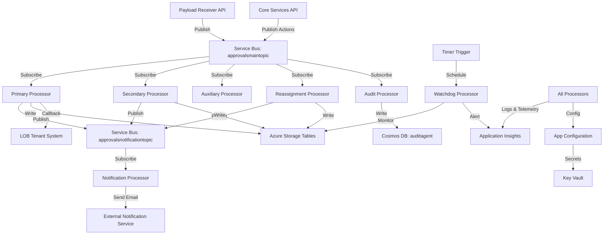
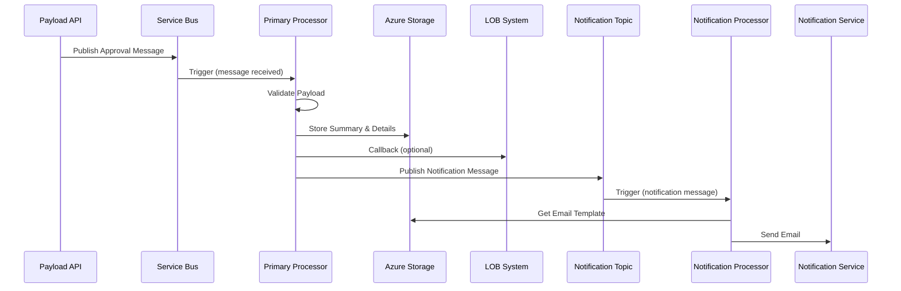

# Services (Azure Functions Processors)

## Summary

This folder contains Azure Functions-based processor services that handle asynchronous background processing for the Microsoft Assent Approvals Platform. These serverless compute services consume messages from Azure Service Bus, process approval workflows, send notifications, and perform monitoring tasks.

### Main Function/Purpose

The processor services implement the core async event-driven architecture of the platform by:

1. **Processing approval payloads** submitted by LOB systems
2. **Orchestrating approval workflows** (validation, storage, callback)
3. **Sending notifications** to approvers and submitters via email
4. **Managing reassignments and delegations**
5. **Performing auxiliary background tasks**
6. **Monitoring system health** and data integrity
7. **Handling retries** for failed operations

### When/Why Developers Work With This Code

Developers work with these processors when:

- Adding new approval workflow logic
- Debugging payload processing issues
- Modifying notification templates or delivery logic
- Implementing new background jobs or scheduled tasks
- Optimizing processor performance or throughput
- Handling failures and implementing retry strategies
- Adding monitoring or health check capabilities
- Investigating Service Bus message handling issues

### Key Technologies

- **.NET 8.0** - Runtime framework
- **Azure Functions v4** - Serverless compute platform
- **Azure Service Bus Triggers** - Message-driven execution
- **Timer Triggers** - Scheduled execution (CRON)
- **Application Insights SDK** - Telemetry and distributed tracing
- **Durable Functions** (if used) - Stateful workflows
- **Polly** - Resilience and retry policies
- **Newtonsoft.Json** - JSON serialization

## Folder Structure

```
Services/
├── Approvals.PrimaryProcessor/          # Core approval processing
│   ├── PrimaryStartup.cs                # DI configuration
│   ├── PrimaryProcessor.cs              # Service Bus triggered function
│   ├── host.json                        # Function host configuration
│   └── Approvals.PrimaryProcessor.csproj
│
├── Approvals.SecondaryProcessor/        # Secondary processing tasks
│   ├── SecondaryStartup.cs
│   ├── SecondaryProcessor.cs
│   └── Approvals.SecondaryProcessor.csproj
│
├── Approvals.NotificationProcessor/     # Email notification delivery
│   ├── NotificationStartup.cs
│   ├── NotificationProcessor.cs
│   └── Approvals.NotificationProcessor.csproj
│
├── Approvals.AuxiliaryProcessor/        # Background and auxiliary tasks
│   ├── AuxiliaryStartup.cs
│   ├── AuxiliaryProcessor.cs
│   └── Approvals.AuxiliaryProcessor.csproj
│
├── Approvals.ReassignmentProcessor/     # Reassignment and delegation handling
│   ├── ReassignmentStartup.cs
│   ├── ReassignmentProcessor.cs
│   └── Approvals.ReassignmentProcessor.csproj
│
└── Approvals.WatchdogProcessor/         # Health monitoring and watchdog
    ├── WatchdogStartup.cs
    ├── WatchdogProcessor.cs             # Timer-triggered monitoring
    └── Approvals.WatchdogProcessor.csproj
```

### Additional Processors (in DevTools/Services)

```
DevTools/Services/
├── Approvals.AuditProcessor/            # Audit logging to Cosmos DB
│   ├── AuditAgentStartup.cs
│   ├── AuditAgentProcessor.cs
│   └── Approvals.AuditProcessor.csproj
│
└── Approvals.PayloadReprocessing/       # Payload reprocessing tool
    ├── PayloadReprocessingStartup.cs
    ├── PayloadReprocessingFunction.cs
    └── Approvals.PayloadReprocessing.csproj
```

### File Naming Conventions

- **Startup Files**: `{ProcessorName}Startup.cs` - Dependency injection configuration
- **Processor/Function Files**: `{ProcessorName}Processor.cs` or `{ProcessorName}Function.cs` - Main function logic
- **host.json**: Azure Functions host configuration (scaling, timeouts, logging)

## Components

### Primary Processor

**Purpose**: Core approval request processing engine

**Trigger**: Service Bus Topic subscription (`approvalsmaintopic/primaryprocessor`)

**Responsibilities**:
1. Receive approval payloads from Service Bus (published by Payload API)
2. Validate payload structure and business rules
3. Transform payload data to internal format
4. Store approval summary and details in Azure Storage
5. Execute callbacks to tenant systems (approval outcome notifications)
6. Publish notification messages to notification topic
7. Handle Create, Update, and Delete operations
8. Implement retry logic for transient failures

**Message Types Processed**:
- **ARConverted**: Converted approval requests
- **ActionableEmail**: Approval actions from email
- **Pull**: Pull requests from tenant systems

**Key Operations**:
- **Create**: New approval request → validate → store summary/details → send notification
- **Update**: Modify existing approval → update storage → notify if needed
- **Delete**: Remove approval → update storage → notify submitter
- **Approve/Reject**: Process action → callback to tenant → update storage → notify

**Retry Strategy**: Exponential backoff with max 5 attempts

### Secondary Processor

**Purpose**: Handles secondary processing tasks and updates

**Trigger**: Service Bus Topic subscription (`approvalsmaintopic/secondaryprocessor`)

**Responsibilities**:
1. Process secondary approval updates
2. Handle approval hierarchies and multi-level approvals
3. Process bulk operations (if applicable)
4. Update approval statuses based on tenant callbacks

**Message Types Processed**:
- **ARConverted**: Approval requests requiring secondary processing
- **Update**: Approval status updates

**Why Separate from Primary?**: 
- Allows independent scaling
- Isolates secondary processing failures from primary flow
- Enables different retry policies

### Notification Processor

**Purpose**: Send email notifications to approvers and submitters

**Trigger**: Service Bus Topic subscription (`approvalsnotificationtopic/notificationprocessor`)

**Responsibilities**:
1. Receive notification requests from Service Bus
2. Retrieve email templates from storage
3. Personalize notification content (merge fields)
4. Call external notification service to send emails
5. Log notification delivery status
6. Handle delivery failures and retries

**Notification Types**:
- **NewApprovalNotification**: Notify approver of new request
- **ActionCompletedNotification**: Notify submitter of approval/rejection
- **ReminderNotification**: Remind approver of pending requests (if enabled)
- **ReassignmentNotification**: Notify new approver after reassignment
- **DelegationNotification**: Notify delegate of new delegation

**Template Management**: Templates stored in `ApprovalEmailNotificationTemplates` table

**External Service Integration**: Calls external notification service REST API with retry logic

### Auxiliary Processor

**Purpose**: Handles auxiliary background tasks and scheduled jobs

**Trigger**: 
- Service Bus Topic subscription (`approvalsmaintopic/auxiliaryprocessor`)
- Timer trigger (for scheduled tasks)

**Responsibilities**:
1. Cleanup expired approvals
2. Archive old data
3. Generate reports or aggregations
4. Process deferred tasks
5. Handle edge cases and special processing

**Scheduled Tasks** (Timer Trigger):
- Data cleanup jobs
- Summary recalculations
- Health checks

**Execution Schedule**: Varies by task (hourly, daily, etc.)

### Reassignment Processor

**Purpose**: Manages approval reassignments and delegations

**Trigger**: Service Bus Topic subscription (`approvalsmaintopic/reassignmentprocessor`)

**Responsibilities**:
1. Process reassignment requests
2. Update approval assignments in storage
3. Apply delegation rules based on date ranges
4. Transfer approvals from manager to delegate
5. Notify affected users of reassignment

**Delegation Logic**:
- Check `UserDelegationSetting` table for active delegations
- Apply tenant-specific or global delegations
- Automatically handle delegation expiration

**Reassignment Scenarios**:
- Manual reassignment by user
- Automatic delegation during out-of-office
- Bulk reassignment for organizational changes

### Watchdog Processor

**Purpose**: Monitors system health, data integrity, and detects anomalies

**Trigger**: Timer trigger (CRON expression: typically every 15-30 minutes)

**Responsibilities**:
1. Check for stuck approvals (old pending requests)
2. Detect data inconsistencies (missing details, orphaned summaries)
3. Monitor Service Bus queue depths and dead letters
4. Validate tenant configuration
5. Check for secret expirations
6. Trigger alerts for detected issues

**Health Checks**:
- **Stuck Approvals**: Approvals pending > X days
- **Missing Details**: Summaries without corresponding details
- **Dead Letter Queue**: Messages in DLQ
- **Processing Delays**: Large message backlogs
- **Configuration Issues**: Missing tenant settings

**Alerting**: Logs critical issues to Application Insights with alert tags

**Execution Schedule**: CRON expression in host.json (e.g., `0 */15 * * * *` = every 15 minutes)

### Audit Processor (DevTools)

**Purpose**: Logs audit events to Cosmos DB for compliance

**Trigger**: Service Bus Topic subscription (`approvalsmaintopic/auditprocessor`)

**Responsibilities**:
1. Receive audit events from Service Bus
2. Transform events to audit log format
3. Store in Cosmos DB (`auditagent` database)
4. Ensure all approval actions are audited

**Audit Events**:
- Payload received
- Approval created/updated/deleted
- Approval action taken (approve, reject, etc.)
- Callback executed
- Configuration changes

**Data Retention**: Configured via Cosmos DB TTL policies

### Payload Reprocessing (DevTools)

**Purpose**: Reprocess failed or historical payloads for recovery

**Trigger**: HTTP trigger (manual invocation) or timer trigger

**Responsibilities**:
1. Retrieve historical payloads from audit history (Cosmos DB)
2. Resubmit payloads to Service Bus for reprocessing
3. Used for data recovery, bug fixes, or migration scenarios

**Use Cases**:
- Recovering from processing failures
- Applying fixes to historical data
- Testing new processing logic on real payloads

**Security**: Restricted to authorized support personnel

## Component Interaction



### Design Patterns

1. **Event-Driven Architecture**: All processors triggered by events (messages or timers)
2. **Pub-Sub Pattern**: Service Bus topics with multiple subscriptions
3. **Dependency Injection**: Services configured in Startup classes
4. **Idempotency**: Processors handle duplicate messages gracefully
5. **Retry Pattern**: Exponential backoff for transient failures
6. **Circuit Breaker**: Polly policies for external service calls
7. **Dead Letter Queue**: Failed messages moved to DLQ for investigation
8. **Correlation Vectors**: Distributed tracing across processors

## Dependencies

### Internal Dependencies

#### Referenced Projects

- **Approvals.Common.BL** - Common business logic
- **Approvals.Common.DL** - Common data access layer
- **Approvals.Common.Extensions** - Extension methods
- **Approvals.Common.LogManager** - Centralized logging
- **Approvals.Common.Utilities** - Utility classes
- **Approvals.Contracts** - Data models and DTOs
- **Approvals.Core.BL** - Core business logic
- **Approvals.Data.Azure.CosmosDb** - Cosmos DB access
- **Approvals.Data.Azure.Storage** - Azure Storage access
- **Approvals.Domain.BL** - Domain-specific business logic
- **Approvals.Messaging.Azure.ServiceBus** - Service Bus messaging

#### Why These Dependencies?

- Same as APIs - processors share business logic layers
- **Messaging.Azure.ServiceBus**: Critical for consuming and publishing messages
- **Core.BL & Domain.BL**: Contains approval processing logic
- **Data layers**: Store and retrieve approval data

### External Dependencies

#### Key NuGet Packages

- **Azure.Messaging.ServiceBus** (^7.x) - Service Bus SDK
- **Microsoft.Azure.Functions.Worker** (^1.x) - Azure Functions isolated worker model
- **Microsoft.Azure.Functions.Worker.Extensions.ServiceBus** (^5.x) - Service Bus trigger bindings
- **Microsoft.Azure.Functions.Worker.Extensions.Timer** (^4.x) - Timer trigger bindings
- **Azure.Identity** (^1.x) - Managed identity authentication
- **Microsoft.ApplicationInsights.WorkerService** (^2.x) - Application Insights for Functions
- **Microsoft.Azure.Cosmos** (^3.x) - Cosmos DB SDK (Audit Processor)
- **Polly** (^7.x) - Resilience patterns
- **Newtonsoft.Json** (^13.x) - JSON serialization

#### Why These Dependencies?

- **Azure Functions SDKs**: Required for serverless execution model
- **Service Bus Extensions**: Enables Service Bus trigger bindings
- **Timer Extensions**: Enables scheduled execution (Watchdog)
- **Azure SDKs**: Access Azure services (Storage, Cosmos DB, Service Bus)
- **Polly**: Adds resilience to external calls (tenant callbacks, notification service)

## Service Integration

### External Services

#### 1. Azure Service Bus

**Usage**: Message queue and pub-sub for event-driven processing

**Topics and Subscriptions**:
- **approvalsmaintopic**: Main processing topic
  - Subscriptions: primaryprocessor, secondaryprocessor, auxiliaryprocessor, reassignmentprocessor, auditprocessor
- **approvalsnotificationtopic**: Notification messages
  - Subscription: notificationprocessor
- **approvalsretrytopic**: Retry/DLQ messages

**Authentication**: Managed Identity

**Message Handling**: At-Least-Once delivery, processors must be idempotent

#### 2. Azure Storage (Tables & Blobs)

**Usage**: Primary data store accessed by most processors

**Tables**:
- ApprovalSummary, ApprovalDetails (Primary/Secondary processors)
- TransactionHistory (audit trail)
- ApprovalEmailNotificationTemplates (Notification processor)
- UserDelegationSetting (Reassignment processor)

**Authentication**: Managed Identity

#### 3. Azure Cosmos DB

**Usage**: Audit logs and history (Audit Processor, history queries)

**Databases**: auditagent, history, telemetry

**Authentication**: Managed Identity

#### 4. External Notification Service

**Usage**: Email delivery (Notification Processor only)

**How it's used**:
- HTTP POST with email payload
- Retry with exponential backoff on failures
- Authentication via API key or client credentials

**Authentication**: Configured credentials from Key Vault

#### 5. LOB Tenant Systems

**Usage**: Callbacks for approval actions (Primary Processor)

**How it's used**:
- HTTP POST to tenant callback URL with approval result
- Includes approval ID, action type, timestamp
- Implements retry logic for transient failures

**Authentication**: Per-tenant authentication (varies by tenant)

#### 6. Application Insights

**Usage**: Logging, telemetry, and distributed tracing

**How it's used**:
- Automatic logging of function executions
- Custom telemetry and metrics
- Exception tracking
- Correlation vectors for end-to-end tracing

**Authentication**: Instrumentation key from configuration

### Data Flow Diagram



## Business Logic

### Key Business Rules Implemented in Processors

1. **Payload Processing (Primary Processor)**:
   - Validate required fields (DocumentNumber, Approver, etc.)
   - Check for duplicate submissions (idempotency)
   - Apply tenant-specific transformations
   - Handle approval hierarchies

2. **Delegation Application (Reassignment Processor)**:
   - Check for active delegations based on current date
   - Apply tenant-specific delegation rules
   - Transfer approvals from manager to delegate
   - Notify delegate of new assignments

3. **Notification Rules (Notification Processor)**:
   - Don't send duplicate notifications (check recent history)
   - Respect user notification preferences
   - Use tenant-specific email templates
   - Handle bounced email addresses

4. **Health Monitoring (Watchdog Processor)**:
   - Flag approvals pending > 30 days
   - Alert on processing backlogs > 1000 messages
   - Detect data inconsistencies (missing details)
   - Monitor dead letter queues

5. **Retry Policies**:
   - Transient failures: Retry 5 times with exponential backoff
   - Permanent failures: Move to dead letter queue
   - Log all retry attempts for troubleshooting

### Configuration-Controlled Behavior

- **Service Bus Configuration**: Max concurrent calls, lock duration, max delivery count
- **Retry Policies**: Configured in host.json or code
- **Watchdog Thresholds**: Alert thresholds for stuck approvals, backlogs, etc.
- **Notification Templates**: Stored in ApprovalEmailNotificationTemplates table
- **Tenant Callbacks**: Callback URLs stored in ApprovalTenantInfo

## Performance and Scaling

### Scaling Behavior

Azure Functions scale automatically based on:
- **Service Bus Queue Depth**: More messages = more instances
- **Max Concurrent Calls**: Configured in host.json (default: 16)
- **Batch Size**: Number of messages processed per invocation

### Performance Optimizations

1. **Parallel Processing**: Multiple messages processed concurrently
2. **Batch Operations**: Batch writes to Storage/Cosmos DB when possible
3. **Async/Await**: Non-blocking I/O operations
4. **Connection Pooling**: Reuse HTTP clients and SDK clients
5. **Efficient Queries**: Partition key-based queries to minimize RU consumption

### host.json Configuration

Example settings for performance tuning:

```json
{
  "version": "2.0",
  "extensions": {
    "serviceBus": {
      "prefetchCount": 100,
      "messageHandlerOptions": {
        "maxConcurrentCalls": 16,
        "autoComplete": true
      }
    }
  },
  "logging": {
    "logLevel": {
      "default": "Information"
    }
  }
}
```

## Troubleshooting

### Common Issues

1. **Messages in Dead Letter Queue**: Check Application Insights for exceptions, validate message format
2. **Processing Delays**: Check Service Bus metrics for backlog, consider scaling
3. **Callback Failures**: Verify tenant callback URLs, check network connectivity, review retry logs
4. **Notification Not Sent**: Check notification topic messages, verify email template exists
5. **Stuck Approvals**: Run Watchdog manually, investigate Application Insights for errors

### Debugging Tips

- **Local Debugging**: Use Azure Storage Emulator or Azurite, Service Bus connection string
- **Application Insights**: Query traces by operation ID or correlation vector
- **Service Bus Explorer**: Inspect messages in queues/topics, replay messages
- **Dead Letter Queue**: Analyze failed messages to identify issues

## Related Documentation

- [High-Level Architecture](../../docs/architecture/HighLevelArchitecture.md) - System architecture overview
- [Deployment Infrastructure](../../docs/architecture/DeploymentInfrastructure.md) - Deployment details
- [Testing Strategy](../../docs/architecture/TestingStrategy.md) - Testing approach
- [Monitoring Strategy](../../docs/architecture/MonitoringStrategy.md) - Monitoring and alerts
- [Contributing Guidelines](../../CONTRIBUTING.md) - Development setup
