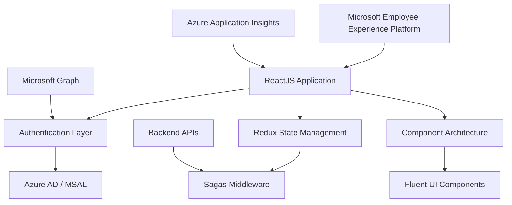
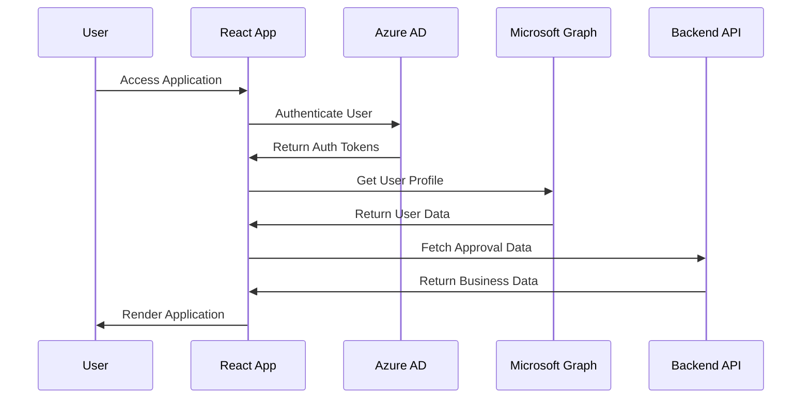

# Microsoft Assent - React.js Application

## Assent <sub>**A***pproval* **S***olution* **S***implified for* **ENT***erprise*<sub>

Microsoft Assent (*a.k.a Approvals*) as a platform provides the "one stop shop" solution for approvers via a model that brings together disparate different approval requests in a consistent and ultra-modern model. Approvals delivers a unified approvals experience for any approval on multiple form factors - Website, Outlook Actionable email, Teams. It consolidates approvals across organization's line of business applications, building on modern technology and powered by Microsoft Azure. It serves as a showcase for solving modern IT scenarios using the latest technologies.

## Summary

The `reactjs` folder contains the Microsoft Assent React web application. This is a modern React application built with TypeScript that provides a comprehensive approval workflow management system integrated with Microsoft's Employee Experience platform and Azure services.

### Main Function/Purpose
- Serve as the primary web interface for Microsoft Assent
- Provide a modern, responsive user experience for approval workflows
- Integrate with Microsoft's ecosystem (Azure AD, Graph API, Employee Experience platform)
- Support multiple approval types across an organization's line of business applications

### When/Why Developers Use This Code
- When developing or maintaining the Microsoft Assent web application
- When implementing new approval workflow features
- When building Microsoft Employee Experience compatible applications  
- When creating enterprise approval systems with Azure integration

### Key Technologies Used
- **React** (v16.8.5) - Core UI framework
- **TypeScript** (v4.5.5) - Type-safe JavaScript development
- **Webpack** (v5.60.0) - Module bundling and build system
- **@fluentui/react** - Microsoft Fluent UI design system
- **Redux & Redux-Saga** - State management and side effects
- **@micro-frontend-react/employee-experience** - Microsoft micro-frontend platform
- **Jest** - Testing framework
- **ESLint & Prettier** - Code quality and formatting

## Folder Structure

```
reactjs/
├── config/                       # Environment-specific configurations
│   └── local.js                 # Local development config (add per-environment files as needed)
├── public/                       # Static assets and HTML template
│   ├── icons/                   # Application icons
│   ├── images/                  # Static images
│   ├── index.html               # HTML template
│   └── meta.json                # Build metadata
├── src/                         # Source code (main application logic)
│   ├── Components/              # React components organized by feature
│   ├── Controls/                # Reusable UI controls
│   ├── Helpers/                 # Utility functions and services
│   ├── Models/                  # TypeScript interfaces and types
│   ├── tests/                   # Test files and utilities
│   ├── App.tsx                  # Main application component
│   ├── Routes.tsx               # Application routing
│   └── ShellWithStore.tsx       # Redux store integration
├── package.json                 # Dependencies and scripts
├── tsconfig.json               # TypeScript configuration
├── webpack.config.js           # Webpack build configuration
├── jest.config.js              # Jest testing configuration
├── .eslintrc.js                # ESLint configuration
└── prettier.config.js          # Prettier formatting configuration
```

## Quick Start

### Development Setup

1. **Update Configuration**: Update the following properties in the appropriate config file (`config/local.js` for local development):
   ```javascript
   __CLIENT_ID__: process.env.clientId || '########-####-####-####-############'
   __INSTRUMENTATION_KEY__: process.env.instrumentationKey || '########-####-####-####-############'
   ```

2. **Install Dependencies**: 
   ```bash
   npm install
   ```

3. **Start Development Server**:
   ```bash
   npm start
   ```
   This will start the development server at `https://localhost:9000/`

### Available Scripts

```json
{
  "start": "Start development server with hot reload",
  "build": "Production build with optimization", 
  "build:prod": "Production build with production config",
  "test": "Run Jest test suite",
  "lint": "ESLint code quality checks",
  "coverage": "Generate test coverage reports"
}
```

## User Feedback Setup

1. **Configure Feedback URL**: Update the `__FEEDBACK_CONFIGURATION_URL__` value in config files to your feedback endpoint. The feedback icon in the top header will only appear if this value is set.

2. **Implement IFeedback Interface**: Implement the `IFeedback` interface provided in `Feedback.ts`. A sample Feedback class is provided in the same file.

3. **Custom Feedback UI**: If using a custom component for the Feedback UI, it can be linked with the top header using the `launchfeedback` event handler of the Feedback class. Any initialization required for the user feedback flow can be done within the constructor.

4. **Initialize Feedback**: Create an instance of your feedback class of type `IFeedback` and pass it to the TopHeader component:
   ```typescript
   setFeedback(new Feedback() as IFeedback);
   <TopHeader upn={user?.email} displayName={user?.name} feedback={feedback} />
   ```

## Architecture Overview

### Application Architecture



### Component Architecture

The application follows a feature-based component organization:

- **Feature Components**: Organized by business functionality (Summary, Details, etc.)
- **Shared Components**: Common UI components and utilities
- **Controls**: Reusable form controls and input elements
- **Helpers**: Utility functions, authentication, and services

### State Management

- **Redux**: Centralized state management
- **Redux-Saga**: Side effect management for API calls
- **Dynamic Reducers**: Feature-specific state management
- **Persistent Reducers**: Client-side state persistence

## Service Integration

### Microsoft Services
- **Azure Active Directory**: Authentication and authorization
- **Microsoft Graph API**: User profiles and organizational data
- **Employee Experience Platform**: Micro-frontend hosting and shared services
- **Azure Application Insights**: Telemetry and performance monitoring

### Backend APIs
- **Approvals API**: Core approval business logic

### Integration Flow



## Testing Strategy

### Test Types
- **Unit Tests**: Component and function testing with Jest
- **Integration Tests**: Feature workflow testing
- **Snapshot Tests**: UI regression testing
- **Coverage Reports**: Code coverage analysis

### Testing Tools
- **Jest**: Primary testing framework
- **@testing-library/react**: React component testing utilities
- **Jest-junit**: JUnit format test reporting for CI/CD

## Design Patterns

### Architectural Patterns
- **Micro-frontend Architecture**: Extensible and maintainable component architecture
- **Flux/Redux Pattern**: Unidirectional data flow
- **Component Composition**: Building complex UIs from simple components
- **Context Provider Pattern**: Dependency injection and shared state

### Development Patterns
- **TypeScript First**: Type-safe development approach
- **Environment-based Configuration**: Multi-environment deployment support
- **Hot Module Replacement**: Enhanced development experience
- **Code Splitting**: Performance optimization through lazy loading

## License

This project is licensed under the MIT License - see the [LICENSE](../../LICENSE) file for details

## Contributing

This project welcomes contributions and suggestions.  Most contributions require you to agree to a
Contributor License Agreement (CLA) declaring that you have the right to, and actually do, grant us
the rights to use your contribution. For details, visit https://cla.opensource.microsoft.com.

When you submit a pull request, a CLA bot will automatically determine whether you need to provide
a CLA and decorate the PR appropriately (e.g., status check, comment). Simply follow the instructions
provided by the bot. You will only need to do this once across all repos using our CLA.

This project has adopted the [Microsoft Open Source Code of Conduct](https://opensource.microsoft.com/codeofconduct/).
For more information see the [Code of Conduct FAQ](https://opensource.microsoft.com/codeofconduct/faq/) or
contact [opencode@microsoft.com](mailto:opencode@microsoft.com) with any additional questions or comments.

## Trademarks

This project may contain trademarks or logos for projects, products, or services. Authorized use of Microsoft
trademarks or logos is subject to and must follow
[Microsoft's Trademark & Brand Guidelines](https://www.microsoft.com/en-us/legal/intellectualproperty/trademarks/usage/general).
Use of Microsoft trademarks or logos in modified versions of this project must not cause confusion or imply Microsoft sponsorship.
Any use of third-party trademarks or logos are subject to those third-party's policies.