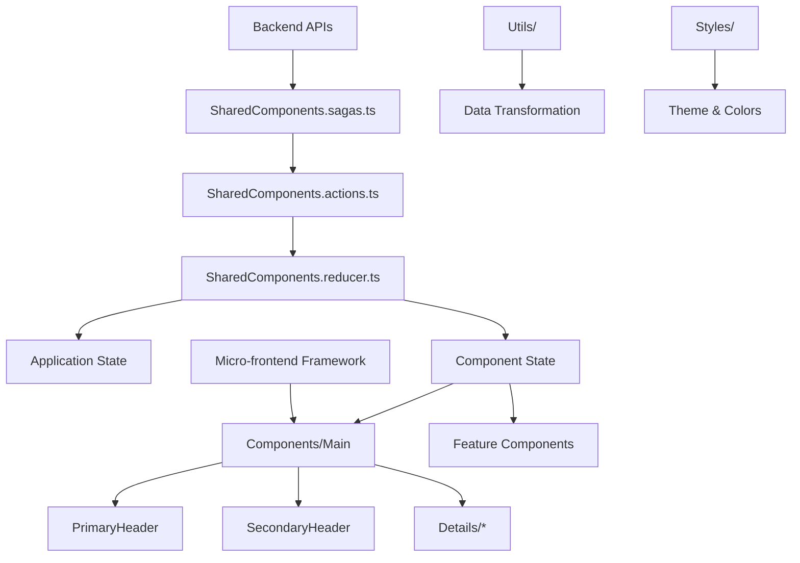
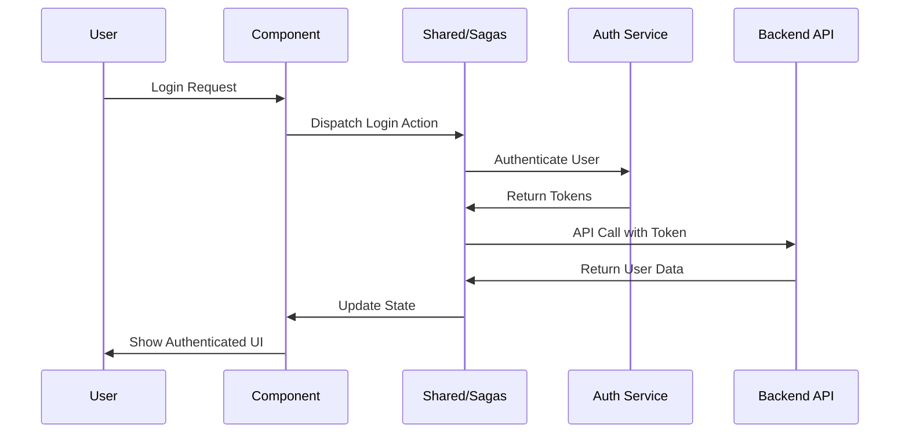

# Shared Components

## Summary

The Shared folder contains reusable components, utilities, state management, and common functionality used across the Microsoft Assent application. This serves as the foundation layer providing shared Redux actions, reducers, selectors, UI components, and utility functions that multiple features depend on.

### Main Function/Purpose
- Provide centralized state management through Redux actions, reducers, and sagas
- Offer reusable UI components and utilities for consistent user experience
- Manage global application state including user profiles, tenant information, and panel states
- Handle common application concerns like authentication, theming, and navigation

### When/Why Developers Use This Code
- When building new features that need access to global application state
- When creating UI components that should maintain consistency with the design system
- When implementing authentication or user management functionality
- When handling async operations and side effects through sagas
- When working with shared business logic or data transformation utilities

### Key Technologies Used
- **Redux & Redux-Saga** - State management and asynchronous operations
- **React** (v16.8.5) - Component framework
- **@fluentui/react** - Microsoft Fluent UI design system
- **@micro-frontend-react/employee-experience** - Micro-frontend framework
- **TypeScript** - Type safety and development tooling
- **Styled Components** - CSS-in-JS styling solution

## Folder Structure

```
Shared/
├── Components/                           # Reusable UI components
│   ├── Main/                            # Main layout components
│   ├── Persona/                         # User persona components
│   ├── PrimaryHeader/                   # Primary navigation header
│   ├── QuickTour/                       # Onboarding tour components
│   └── SecondaryHeader/                 # Secondary navigation elements
├── Details/                             # Detail view components
│   ├── DetailsButtons/                  # Action buttons for detail views
│   ├── DetailsMessageBars/              # Message and notification bars
│   ├── DocumentPreview/                 # Document preview functionality
│   └── FileUpload/                      # File upload components
├── Markdown/                            # Markdown rendering utilities
├── Styles/                              # Shared styling and themes
├── Utils/                               # Utility functions and helpers
├── SharedColors.ts                      # Color constants and theme colors
├── SharedComponents.action-types.ts     # Redux action type constants
├── SharedComponents.actions.ts          # Redux action creators
├── SharedComponents.persistent-reducer.ts # Persistent state reducer
├── SharedComponents.persistent-selectors.ts # Persistent state selectors
├── SharedComponents.reducer.ts          # Main shared state reducer
├── SharedComponents.sagas.ts            # Redux-Saga side effects
├── SharedComponents.selectors.ts        # Redux state selectors
├── SharedComponents.types.ts            # TypeScript type definitions
├── SharedConstants.ts                   # Application-wide constants
└── SharedLayout.ts                      # Layout styled components
```

## Components

### State Management Components

#### SharedComponents.reducer.ts
- **Purpose**: Central Redux reducer for shared application state
- **Responsibilities**: Manages user profiles, tenant info, panel states, and navigation
- **Key State**: User data, summary information, UI panel visibility, selected pages

#### SharedComponents.actions.ts
- **Purpose**: Redux action creators for shared functionality
- **Responsibilities**: Creates actions for API calls, state updates, and UI interactions
- **Key Actions**: Profile requests, summary data fetching, panel state management

#### SharedComponents.sagas.ts
- **Purpose**: Handles asynchronous operations and side effects
- **Responsibilities**: API calls, data transformation, error handling
- **Integration**: Interfaces with backend services and external APIs

### UI Components

#### Main Component
- **Purpose**: Primary layout wrapper for the application
- **Responsibilities**: Page structure, navigation integration, responsive design
- **Integration**: Works with header components and navigation

#### PrimaryHeader/SecondaryHeader
- **Purpose**: Navigation and user interface headers
- **Responsibilities**: User menu, navigation links, global actions
- **Integration**: Connected to authentication and user profile state

#### Details Components
- **Purpose**: Standardized detail view components
- **Responsibilities**: Document display, action buttons, file management
- **Integration**: Used across different approval detail views

### Component Interaction Diagram



## Dependencies

### In-Repo Dependencies
- **Helpers**: Utility functions for data processing and transformations
- **Models**: TypeScript interfaces and data structures
- **Controls**: Reusable form controls and input components

### External Dependencies
- **@micro-frontend-react/employee-experience**: Core micro-frontend framework providing authentication, theming, and shell integration
- **@fluentui/react**: Microsoft's Fluent UI component library for consistent design
- **redux & redux-saga**: State management and side effect handling
- **react & react-dom**: Core React framework
- **styled-components**: CSS-in-JS styling library

### Service Integration

The Shared folder integrates with several external services:

#### Microsoft Graph API
- **Usage**: User profile information, authentication, and directory services
- **Authentication**: Azure AD integration through micro-frontend framework
- **Data Flow**: User profile → Redux state → UI components

#### Approvals Backend API
- **Usage**: Tenant information, summary data, approval details
- **Authentication**: Bearer tokens and API scopes
- **Data Flow**: API calls → Sagas → Redux actions → State updates

### Authentication Flow Diagram



### Design Patterns

- **Redux Pattern**: Centralized state management with predictable state updates
- **Saga Pattern**: Declarative side effect management for async operations
- **Container/Presentation Pattern**: Separation of data logic from UI presentation
- **Provider Pattern**: Context-based dependency injection for micro-frontend integration
- **Factory Pattern**: Dynamic component creation and configuration
- **Observer Pattern**: State change notifications and component updates
