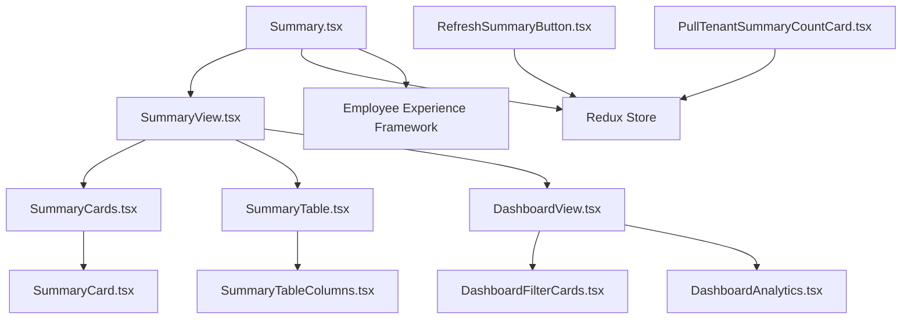

# Summary Component

## Summary

The Summary component provides the main dashboard and summary view functionality for the Microsoft Assent application. This folder contains all components related to displaying approval summaries, tenant information, analytics dashboards, and summary cards for pending approvals.

### Main Function/Purpose
- Display summary information for pending approvals across different tenants
- Provide dashboard analytics and filtering capabilities  
- Show approval counts and status information in card and table formats
- Enable refresh functionality for real-time data updates

### When/Why Developers Use This Code
- When implementing dashboard functionality for approval systems
- When displaying summary statistics and analytics
- When building tenant-specific approval summaries
- When creating data visualization components for approval workflows

### Key Technologies Used
- **React** (v16.8.5) - Component framework
- **Redux & Redux-Saga** - State management and side effects
- **@fluentui/react** - Microsoft Fluent UI components
- **TypeScript** - Type safety and development experience
- **Styled Components** - Component styling

## Folder Structure

```
Summary/
├── Dashboard/                    # Analytics dashboard components
│   ├── DashboardAnalytics.tsx   # Analytics visualization
│   ├── DashboardFilterCards.tsx # Filter controls
│   ├── DashboardFilterConfig.ts # Filter configuration
│   ├── DashboardFilterUtils.ts  # Filter utility functions
│   ├── DashboardView.tsx        # Main dashboard view
│   └── FilterTags.tsx           # Filter tag display
├── Models/                      # TypeScript interfaces and models
│   └── ISummaryData.ts         # Summary data interface
├── SummaryCards/                # Card-based summary display
│   ├── Models/                 # Card-specific models
│   ├── SummaryCard.styled.ts   # Card styling
│   ├── SummaryCard.tsx         # Individual card component
│   ├── SummaryCard.types.ts    # Card type definitions
│   └── SummaryCards.tsx        # Cards container component
├── SummaryTable/               # Table-based summary display
│   ├── PullTenantColumns.tsx   # Pull tenant column definitions
│   ├── SummaryTable.tsx        # Main table component
│   ├── SummaryTable.types.ts   # Table type definitions
│   ├── SummaryTableColumns.tsx # Table column configurations
│   ├── SummaryTableFieldNames.ts # Field name constants
│   ├── SummaryTableStyling.ts  # Table styling
│   └── TenantColumns.tsx       # Tenant column definitions
├── Summary.tsx                 # Main summary component
├── SummaryStyling.ts          # Summary component styling
├── SummaryView.tsx            # Summary view layout
├── RefreshSummaryButton.tsx   # Data refresh control
├── PullTenantSummaryCountBanner.tsx # Tenant count banner
└── PullTenantSummaryCountCard.tsx   # Tenant count card
```

## Components

### Core Components

#### Summary.tsx
- **Purpose**: Main entry point for the summary functionality
- **Responsibilities**: State management setup, saga initialization, and component orchestration
- **Integration**: Connects with Redux store and Employee Experience framework

#### SummaryView.tsx  
- **Purpose**: Layout and view logic for the summary page
- **Responsibilities**: Handles view switching between cards and table modes
- **Integration**: Manages panel states and details view

#### SummaryCards.tsx
- **Purpose**: Container for approval summary cards
- **Responsibilities**: Displays approval counts and tenant information in card format
- **Integration**: Connects to summary data from Redux store

#### SummaryTable.tsx
- **Purpose**: Table-based display of approval summaries
- **Responsibilities**: Shows detailed approval information in tabular format with sorting and filtering
- **Integration**: Uses Fluent UI DetailsList component

### Dashboard Components

#### DashboardView.tsx
- **Purpose**: Analytics dashboard for approval metrics
- **Responsibilities**: Displays charts, graphs, and analytical insights
- **Integration**: Integrates with filtering and analytics data

#### DashboardFilterCards.tsx
- **Purpose**: Provides filtering controls for dashboard data
- **Responsibilities**: Handles filter selection and application
- **Integration**: Updates dashboard view based on filter selections

### Component Interaction Diagram



## Dependencies

### In-Repo Dependencies
- **SharedComponents**: Shared Redux reducers, sagas, and actions
- **SharedComponents.reducer**: State management for shared functionality
- **SharedComponents.sagas**: Side effect management
- **Details components**: For displaying approval details in panels
- **Employee Experience Framework**: Micro-frontend integration

### External Dependencies
- **@fluentui/react**: UI components (DetailsList, Stack, etc.)
- **@micro-frontend-react/employee-experience**: Micro-frontend framework
- **redux & redux-saga**: State management
- **react**: Core React functionality
- **styled-components**: Component styling

### Design Patterns
- **Container/Presentation Pattern**: Separates data logic from UI presentation
- **Redux Pattern**: Centralized state management with actions and reducers
- **Saga Pattern**: Handles asynchronous operations and side effects
- **Micro-frontend Pattern**: Integrates with larger employee experience platform
