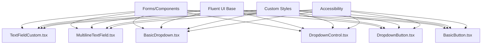

# Controls

## Summary

The Controls folder contains reusable UI form controls and input components used throughout the Microsoft Assent application. These components provide consistent styling, behavior, and accessibility features across the application while extending Fluent UI components with custom functionality.

### Main Function/Purpose
- Provide standardized form controls with consistent styling
- Extend Fluent UI components with application-specific behavior
- Ensure accessibility compliance across all input controls
- Offer specialized controls for approval workflow interactions

### When/Why Developers Use This Code
- When building forms for approval workflows
- When implementing user input interfaces
- When maintaining design consistency across the application
- When extending Fluent UI components with custom functionality

### Key Technologies Used
- **@fluentui/react** - Base UI component library
- **React** (v16.8.5) - Component framework
- **TypeScript** - Type safety and development experience
- **Styled Components** - Custom styling and theming

## Folder Structure

```
Controls/
├── styles/                    # Control-specific styling
├── BasicButton.tsx           # Standard button component
├── BasicDropdown.tsx         # Dropdown selection control
├── DropdownButton.tsx        # Button with dropdown menu
├── DropdownControl.tsx       # Advanced dropdown control
├── MultilineTextField.tsx    # Multi-line text input
└── TextFieldCustom.tsx       # Custom text field component
```

## Components

### Input Controls

#### TextFieldCustom.tsx
- **Purpose**: Custom text input field with application-specific styling
- **Responsibilities**: 
  - Text input with validation support
  - Consistent styling across the application
  - Accessibility features (ARIA labels, keyboard navigation)
- **Integration**: Extends Fluent UI TextField with custom properties

#### MultilineTextField.tsx
- **Purpose**: Multi-line text input for longer content
- **Responsibilities**:
  - Rich text input capabilities
  - Auto-resize functionality
  - Character count and validation
- **Integration**: Used in approval comments and feedback forms

### Selection Controls

#### BasicDropdown.tsx
- **Purpose**: Standard dropdown selection component
- **Responsibilities**:
  - Single and multi-select options
  - Search/filter functionality
  - Keyboard navigation support
- **Integration**: Extends Fluent UI Dropdown with custom behavior

#### DropdownControl.tsx
- **Purpose**: Advanced dropdown with additional functionality
- **Responsibilities**:
  - Complex selection scenarios
  - Custom option rendering
  - Dynamic option loading
- **Integration**: Used in filtering and advanced search scenarios

#### DropdownButton.tsx
- **Purpose**: Button component with integrated dropdown menu
- **Responsibilities**:
  - Action selection through dropdown
  - Context menu functionality
  - Split button behavior
- **Integration**: Used for bulk actions and context-sensitive operations

### Action Controls

#### BasicButton.tsx
- **Purpose**: Standardized button component
- **Responsibilities**:
  - Consistent button styling and behavior
  - Loading states and disabled states
  - Accessibility compliance
- **Integration**: Base button used throughout the application

### Component Interaction Diagram



## Dependencies

### In-Repo Dependencies
- **Shared/Styles**: Common styling utilities and theme variables
- **Helpers**: Utility functions for validation and data processing

### External Dependencies
- **@fluentui/react**: Base UI components (TextField, Dropdown, Button, etc.)
- **react**: Core React functionality
- **styled-components**: Custom styling system

### Design Patterns
- **Composition Pattern**: Building complex controls from simpler components
- **Props-based Configuration**: Flexible component behavior through props
- **Render Props Pattern**: Customizable rendering for dropdown options
- **Controlled Component Pattern**: Parent components manage control state
- **Accessibility Pattern**: Consistent ARIA labels and keyboard navigation
