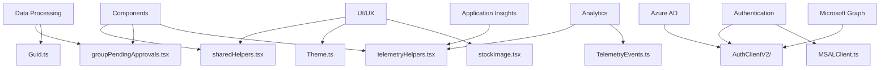
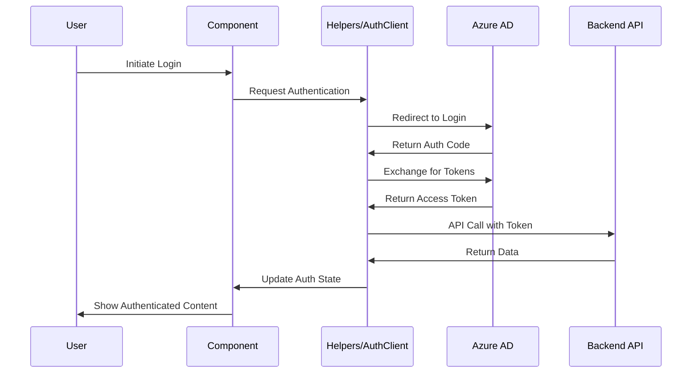

# Helpers

## Summary

The Helpers folder contains utility functions, authentication clients, and shared helper logic used throughout the Microsoft Assent application. This folder provides essential utilities for authentication, data processing, telemetry, theming, and common UI interactions.

### Main Function/Purpose
- Provide authentication and authorization utilities
- Offer data transformation and processing functions
- Handle telemetry and analytics event tracking
- Manage theming and UI interaction helpers
- Support GUID generation and manipulation

### When/Why Developers Use This Code
- When implementing authentication flows and token management
- When processing and grouping approval data
- When adding telemetry tracking to user interactions
- When creating accessible UI interactions (keyboard navigation)
- When working with Microsoft Graph API integration

### Key Technologies Used
- **@azure/msal-browser** - Microsoft Authentication Library
- **Microsoft Graph API** - User and organizational data
- **Application Insights** - Telemetry and analytics
- **React Router** - Navigation utilities
- **Lodash** - Data manipulation utilities
- **TypeScript** - Type safety and development experience

## Folder Structure

```
Helpers/
├── AuthClientV2/                    # Modern authentication client
│   └── (authentication utilities)   # V2 MSAL implementation
├── groupPendingApprovals.tsx        # Approval data grouping logic
├── Guid.ts                          # GUID generation utilities
├── MSALClient.ts                    # Legacy MSAL client
├── sharedHelpers.tsx                # Common utility functions
├── stockImage.tsx                   # Image handling utilities
├── TelemetryEvents.ts               # Telemetry event definitions
├── telemetryHelpers.tsx             # Telemetry tracking utilities
└── Theme.ts                         # Application theming utilities
```

## Components

### Authentication Components

#### AuthClientV2/
- **Purpose**: Modern authentication client using MSAL v2
- **Responsibilities**: 
  - Handle Azure AD authentication flows
  - Manage access tokens and refresh tokens
  - Provide authentication state management
- **Integration**: Replaces legacy MSAL implementation with modern patterns

#### MSALClient.ts
- **Purpose**: Legacy Microsoft Authentication Library client
- **Responsibilities**: Authentication token management for backward compatibility
- **Integration**: Being phased out in favor of AuthClientV2

### Data Processing Utilities

#### groupPendingApprovals.tsx
- **Purpose**: Groups and organizes pending approval data
- **Responsibilities**:
  - Sort approvals by various criteria (date, tenant, type)
  - Group approvals for efficient display
  - Provide data transformation for summary views
- **Integration**: Used by Summary and Dashboard components

#### sharedHelpers.tsx
- **Purpose**: Common utility functions for UI and data operations
- **Key Functions**:
  - `imitateClickOnKeyPressForDiv`: Accessibility helper for keyboard navigation
  - `imitateClickOnKeyPressForAnchor`: Keyboard accessibility for links
  - Media query and responsive design helpers
- **Integration**: Used across multiple components for consistent behavior

### Telemetry and Analytics

#### telemetryHelpers.tsx
- **Purpose**: Application Insights integration and event tracking
- **Responsibilities**:
  - Track user interactions and events
  - Monitor application performance
  - Collect usage analytics
- **Integration**: Connected to Azure Application Insights

#### TelemetryEvents.ts
- **Purpose**: Centralized telemetry event definitions
- **Responsibilities**: 
  - Define standard telemetry events
  - Ensure consistent event naming
  - Type safety for telemetry data

### Utility Functions

#### Guid.ts
- **Purpose**: GUID generation and manipulation utilities
- **Responsibilities**: Generate unique identifiers for components and data
- **Integration**: Used for tracking, caching, and unique element IDs

#### Theme.ts
- **Purpose**: Application theming and design token management
- **Responsibilities**: 
  - Define color schemes and design tokens
  - Provide theme switching capabilities
  - Integrate with Fluent UI theming system

#### stockImage.tsx
- **Purpose**: Image handling and placeholder utilities
- **Responsibilities**: Provide default images and image loading helpers
- **Integration**: Used in user profiles and document previews

### Helper Functions Interaction Diagram



## Dependencies

### In-Repo Dependencies
- **Components/Shared**: Shared styling and media query utilities
- **Models**: TypeScript interfaces for data structures
- **Configuration**: Application configuration and environment variables

### External Dependencies
- **@azure/msal-browser**: Modern Microsoft Authentication Library
- **@microsoft/applicationinsights-web**: Telemetry and analytics
- **react-router-dom**: Navigation and routing utilities
- **lodash**: Data manipulation and utility functions

### Service Integration

#### Azure Active Directory
- **Usage**: User authentication and authorization
- **Authentication Method**: OAuth 2.0 / OpenID Connect
- **Data Flow**: User login → Token acquisition → API access

#### Microsoft Graph API  
- **Usage**: User profile data, organizational information
- **Authentication**: Bearer tokens from Azure AD
- **Data Flow**: Authenticated requests → User data → Profile display

#### Application Insights
- **Usage**: Telemetry, performance monitoring, usage analytics
- **Authentication**: Instrumentation key-based
- **Data Flow**: User actions → Telemetry events → Analytics dashboard

### Authentication Flow Diagram



### Design Patterns
- **Singleton Pattern**: Authentication client instances
- **Factory Pattern**: GUID generation utilities  
- **Observer Pattern**: Telemetry event tracking
- **Strategy Pattern**: Different authentication strategies (V1 vs V2)
- **Utility Pattern**: Pure functions for data transformation
- **Decorator Pattern**: Adding telemetry to component interactions
