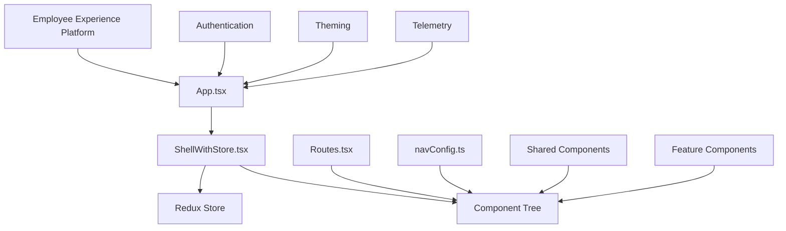
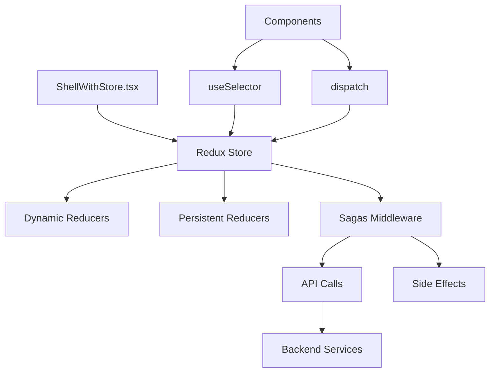

# Source Code (src)

## Summary

The `src` folder contains the main source code for the Microsoft Assent React application. This is the core of the application containing components, routing, state management, utilities, and the main application entry points. The application is built using React with TypeScript and follows a micro-frontend architecture pattern.

### Main Function/Purpose
- Serve as the main entry point for the Microsoft Assent web application
- Provide a structured architecture for approval workflow management
- Implement micro-frontend patterns for extensibility and maintainability
- Handle routing, authentication, and global application state

### When/Why Developers Use This Code
- When developing the main Microsoft Assent web application
- When implementing new approval workflow features
- When integrating with Microsoft Employee Experience platform
- When extending the application with micro-frontend capabilities

### Key Technologies Used
- **React** (v16.8.5) - Core UI framework
- **TypeScript** - Type safety and enhanced development experience  
- **@micro-frontend-react/employee-experience** - Microsoft micro-frontend platform
- **Redux & Redux-Saga** - State management and side effects
- **@fluentui/react** - Microsoft Fluent UI design system
- **React Router** - Client-side routing
- **Azure MSAL** - Microsoft Authentication Library

## Folder Structure

```
src/
├── Components/                    # Reusable UI components and features
│   ├── AccessibilityPanel/       # Accessibility settings and tools
│   ├── Admin/                    # Administration and management views
│   ├── FAQ/                      # Frequently asked questions
│   ├── Feedback/                 # User feedback and rating systems
│   ├── HelpPanel/                # Help and documentation panel
│   ├── History/                  # Approval history and tracking
│   ├── MicrofrontendPage/        # Micro-frontend integration page
│   ├── NotificationsPanel/       # Notification management
│   ├── OutOfSync/                # Data synchronization handling
│   ├── PendingApprovals/         # Pending approval management
│   ├── Shared/                   # Shared components and utilities
│   ├── Summary/                  # Dashboard and summary views
│   ├── SupportBot/               # Support chatbot integration
│   └── UserSettingsPanel/       # User preferences and settings
├── Controls/                      # Reusable form controls and UI elements
├── Helpers/                       # Utility functions and helper classes
├── Models/                        # TypeScript interfaces and data models
├── tests/                         # Test files and test utilities
├── App.tsx                        # Main application component
├── App.css                        # Global application styles
├── App.test.js                    # Application tests
├── navConfig.ts                   # Navigation configuration
├── Routes.tsx                     # Application routing configuration
└── ShellWithStore.tsx             # Redux store integration shell
```

## Core Application Files

### App.tsx
- **Purpose**: Main application entry point and bootstrap
- **Responsibilities**: 
  - Initialize authentication and user context
  - Set up Redux store and dynamic reducers
  - Configure theming and icon libraries
  - Orchestrate application shell components
- **Key Features**:
  - MSAL authentication integration
  - Employee Experience framework integration
  - Fluent UI theming and icon initialization
  - Telemetry and feedback system setup

### Routes.tsx
- **Purpose**: Application routing configuration
- **Responsibilities**:
  - Define application routes and navigation paths
  - Handle route-based component loading
  - Manage route guards and authentication requirements
- **Integration**: Works with React Router for client-side navigation

### ShellWithStore.tsx
- **Purpose**: Redux store provider and application shell
- **Responsibilities**:
  - Provide Redux store to application components
  - Handle store configuration and middleware setup
  - Integrate with Employee Experience context
- **Integration**: Connects Redux state management with micro-frontend framework

### navConfig.ts
- **Purpose**: Navigation menu configuration
- **Responsibilities**:
  - Define navigation structure and menu items
  - Configure navigation permissions and visibility
  - Provide navigation metadata and routing information

## Application Architecture

### Micro-frontend Integration

The application integrates with Microsoft's Employee Experience platform:



### State Management Architecture



## Dependencies

### In-Repo Dependencies
- **Components**: Feature-specific React components
- **Controls**: Reusable UI form controls
- **Helpers**: Utility functions and authentication
- **Models**: TypeScript interfaces and data structures

### External Dependencies
- **@micro-frontend-react/employee-experience**: Microsoft's micro-frontend platform
- **@fluentui/react**: Microsoft Fluent UI component library
- **@azure/msal-browser**: Microsoft Authentication Library
- **redux & redux-saga**: State management and side effects
- **react-router-dom**: Client-side routing
- **@microsoft/applicationinsights-web**: Telemetry and analytics

### Service Integration

#### Employee Experience Platform
- **Purpose**: Micro-frontend host and shared services
- **Authentication**: Single sign-on and user context
- **Integration**: Provides shell, theming, and common services

#### Microsoft Graph API
- **Purpose**: User profile and organizational data
- **Authentication**: Azure AD tokens through MSAL
- **Usage**: User information, photos, and directory services

#### Approvals Backend API
- **Purpose**: Core approval business logic and data
- **Authentication**: Bearer token authentication
- **Usage**: Approval workflows, tenant data, and business operations

## Business Logic

### Core Approval Workflows
- **Pending Approvals**: Management of items awaiting approval
- **History Tracking**: Audit trail and historical approval data
- **Delegation**: Approval authority delegation capabilities
- **Multi-tenant Support**: Cross-organizational approval management

### Design Patterns
- **Micro-frontend Architecture**: Extensible and maintainable component architecture
- **Redux Pattern**: Predictable state management with actions and reducers
- **Component Composition**: Building complex UIs from reusable components
- **Context Provider Pattern**: Dependency injection and shared state
- **Saga Pattern**: Declarative side effect management
- **Route-based Code Splitting**: Performance optimization through lazy loading
